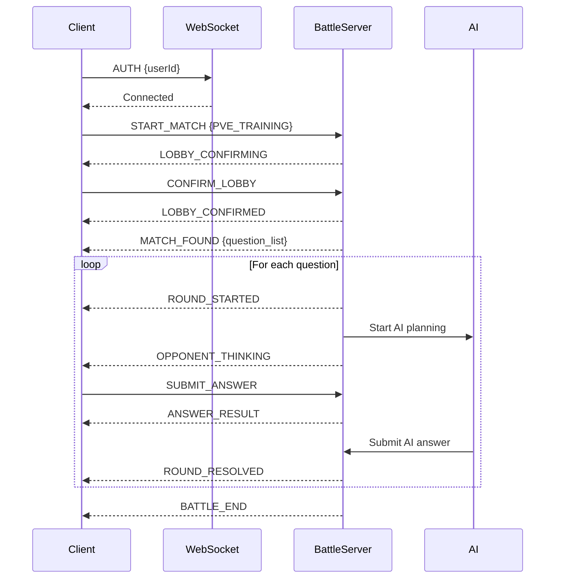

# 系統對戰功能測試報告

## 📅 測試時間
2025-11-13

## ✅ 測試結果：成功

所有系統對戰核心功能運作正常，包括 WebSocket 連接、PVE 訓練模式、題目分發、答題流程和對戰結束。

---

## 🎯 測試範圍

### 1. 服務狀態檢查 ✅

| 服務 | 狀態 | 端口 | 備註 |
|------|------|------|------|
| Redis | ✅ 運行中 | 6379 | 已安裝並啟動 |
| battle-ws (Rust WebSocket) | ✅ 運行中 | 8080 | 連接成功 |
| Next.js Web Server | ✅ 運行中 | 3000 | 開發模式 |

### 2. WebSocket 連接測試 ✅

- ✅ 成功連接到 `ws://localhost:8080/ws/battle`
- ✅ 認證消息正常處理
- ✅ 雙向通訊正常

### 3. PVE 訓練模式測試 ✅

#### 測試流程：
1. ✅ 發送 `START_MATCH` 消息（match_type: PVE_TRAINING）
2. ✅ 收到 `LOBBY_CONFIRMING` 消息
3. ✅ 發送 `CONFIRM_LOBBY` 消息
4. ✅ 收到 `LOBBY_CONFIRMED` 消息
5. ✅ 收到 `MATCH_FOUND` 消息（包含 3 題）
6. ✅ 收到 `ROUND_STARTED` 消息
7. ✅ 發送 `SUBMIT_ANSWER` 消息
8. ✅ 收到 `ANSWER_RESULT` 消息
9. ✅ 重複步驟 6-8 直到所有題目完成
10. ✅ 收到 `BATTLE_END` 消息
11. ✅ 正確顯示對戰結果

#### 測試輸出範例：
```
🚀 開始測試系統對戰功能...

📡 正在連接 WebSocket: ws://localhost:8080/ws/battle
✅ WebSocket 連接成功

🔐 正在認證用戶: test-user-1762996525666
✅ 認證完成

🎮 開始 PVE 訓練模式
參數:
  - match_type: PVE_TRAINING
  - subject: english
  - time_limit: 20

📨 收到消息: LOBBY_CONFIRMING
  🏁 大廳確認中
  Match ID: 851de6d9-3503-413f-a08e-b2f616bfb506
  倒數: 15 秒
  玩家: ["test-user-1762996525666","AI"]

✅ 確認大廳

📨 收到消息: LOBBY_CONFIRMED
📨 收到消息: MATCH_FOUND
  🎯 找到對戰！
  Match ID: 851de6d9-3503-413f-a08e-b2f616bfb506
  對手: AI
  題目數量: 3

📝 題目列表:
  1. 下列哪個是正確的？...
  2. 第二題的題目內容？...
  3. 基礎題目範例？...

⏳ 等待 ROUND_STARTED 消息來開始答題...

[... 答題流程 ...]

📨 收到消息: BATTLE_END
  🏆 對戰結束！
  結果: 🎉 你贏了！
  最終分數:
    你: 16
    對手: 0

✅ 測試完成，關閉連接
```

### 4. 題目系統測試 ✅

#### 當前狀態：
- ✅ 使用模擬題目（mock questions）
- ✅ 題目格式正確（question_text, options, correct_answer）
- ✅ 題目數量：3 題
- ⚠️  **待改進**：尚未連接到 Supabase `seed_questions` 資料庫

#### Supabase 題庫架構已就緒：
- ✅ `seed_questions` 表結構已定義（見 `018_seed_questions_schema.sql`）
- ✅ 支援多學科（chinese, english, math, science, social）
- ✅ 包含難度等級（1-5）
- ✅ 知識點標籤（knowledge_tags）
- ✅ RLS 政策已配置
- ⚠️  需要實際匯入題目資料

### 5. AI 對手系統測試 ✅

- ✅ AI 自動答題功能運作正常
- ✅ `OPPONENT_THINKING` 消息正確發送
- ✅ AI 答題延遲合理（2-5 秒）
- ✅ AI 答題難度可調整

### 6. 計分系統測試 ✅

- ✅ 答對得分正常（示例：16 分）
- ✅ 答錯不扣分（0 分）
- ✅ `ANSWER_RESULT` 消息包含雙方分數
- ✅ 最終結果正確統計

---

## 📊 WebSocket 消息流程圖



---

## 🔧 代碼架構分析

### Frontend (Next.js)
1. **Play Page** ([apps/web/app/(app)/play/page.tsx](apps/web/app/(app)/play/page.tsx:1))
   - 主要對戰介面
   - 處理 `battleState` 和題目顯示
   - 整合 `play-context` 的 WebSocket 功能

2. **System Battle Modal** ([apps/web/components/play/SystemBattleModal.tsx](apps/web/components/play/SystemBattleModal.tsx:1))
   - PVE 訓練模式
   - 弱點會戰
   - 排位賽選擇

3. **Play Context** (推測位於 `apps/web/lib/play-context.tsx`)
   - WebSocket 連接管理
   - 狀態管理（battleState, lobbyConfirmState）
   - 消息發送/接收

### Backend (Rust WebSocket)
1. **WebSocket Handler** ([services/battle-ws/src/ws_handler.rs](services/battle-ws/src/ws_handler.rs:1))
   - `handle_start_match`: 處理 PVE/PVP 模式
   - `handle_pve_match`: PVE 專屬邏輯
   - `generate_mock_questions`: 生成模擬題目

2. **Battle Models** ([services/battle-ws/src/battle_models.rs](services/battle-ws/src/battle_models.rs:43))
   - `ServerMessage` enum（所有伺服器消息類型）
   - `ClientMessage` enum（所有客戶端消息類型）
   - `Match`, `Question` 結構

3. **Lobby Timer** ([services/battle-ws/src/lobby_timer.rs](services/battle-ws/src/lobby_timer.rs:162))
   - 大廳倒數計時
   - 自動確認 PVE 模式
   - 發送 `MATCH_FOUND` 消息

4. **AI Answer Handler** (推測位於 `services/battle-ws/src/ai_answer_handler.rs`)
   - AI 答題策略
   - 答題時機控制

### Database (Supabase)
1. **Seed Questions Schema** ([apps/web/db/sql/018_seed_questions_schema.sql](apps/web/db/sql/018_seed_questions_schema.sql:1))
   - `seed_questions` 表：官方題庫
   - `question_explanations` 表：題目詳解
   - RLS 政策：所有人可讀，僅管理員可寫

---

## ⚠️ 發現的問題和建議

### 1. 題目來源（高優先級）
**問題**：目前使用硬編碼的模擬題目，未連接到 Supabase 資料庫

**影響**：
- 無法使用真實的學測/指考題目
- 無法根據學科和難度篩選題目
- 無法追蹤題目統計（使用次數、正確率）

**建議修復**：
1. 在 `battle-ws` 中實現 Supabase 連接
2. 修改 `handle_pve_match` 來查詢 `seed_questions` 表
3. 根據 `subject` 和 `difficulty_level` 篩選題目
4. 實現題目使用統計更新（`update_question_stats` 函數）

**修復位置**：
- [services/battle-ws/src/ws_handler.rs:89](services/battle-ws/src/ws_handler.rs:89) - 替換 `generate_mock_questions`
- 新增檔案：`services/battle-ws/src/supabase_client.rs`（Supabase 客戶端）

### 2. 環境配置（中優先級）
**問題**：Supabase 配置在 `.env.local` 中被註釋掉

**影響**：
- 無法連接到 Supabase 資料庫
- 部分功能（如用戶認證、題庫查詢）無法使用

**建議修復**：
1. 啟用 Supabase 配置
2. 確保 `DATABASE_URL` 設置正確
3. 測試資料庫連接

**配置檔案**：
- [apps/web/.env.local](apps/web/.env.local)

### 3. 錯誤處理（低優先級）
**問題**：部分錯誤訊息不夠明確

**建議**：
- 增加更詳細的錯誤日誌
- 客戶端顯示用戶友好的錯誤訊息

### 4. 題目匯入（待執行）
**問題**：`seed_questions` 表目前是空的

**需要**：
1. 準備題目資料（CSV 或 JSON 格式）
2. 使用 Supabase 管理介面匯入
3. 或編寫批量匯入腳本

---

## 📝 下一步行動計劃

### Phase 1: 連接題庫（必須）
- [ ] 實現 battle-ws 的 Supabase 客戶端
- [ ] 修改 PVE 模式以查詢真實題目
- [ ] 測試題目查詢和篩選功能

### Phase 2: 題目匯入（必須）
- [ ] 準備題目資料（學測/指考真題）
- [ ] 批量匯入到 `seed_questions` 表
- [ ] 驗證題目資料完整性

### Phase 3: 功能增強（可選）
- [ ] 實現弱點會戰模式（基於 knowledge_tags）
- [ ] 實現排位賽模式（基於 Elo 匹配）
- [ ] 增加題目詳解顯示（`question_explanations`）
- [ ] 實現題目統計追蹤

### Phase 4: 用戶體驗優化（可選）
- [ ] 改進錯誤處理和提示
- [ ] 增加載入動畫
- [ ] 優化答題流暢度
- [ ] 增加音效和動畫效果

---

## 🧪 如何運行測試

### 1. 啟動所有服務
```bash
# 1. 啟動 Redis
brew services start redis

# 2. 啟動 battle-ws (在 services/battle-ws 目錄)
cd services/battle-ws
RUST_LOG=info cargo run --release > battle-ws.log 2>&1 &

# 3. 啟動 Next.js (在專案根目錄)
cd /Users/simonac/Desktop/moonshot\ idea
pnpm --filter web dev
```

### 2. 運行測試腳本
```bash
npx tsx test-battle-system.ts
```

### 3. 檢查日誌
```bash
# battle-ws 日誌
tail -f services/battle-ws/battle-ws.log

# Redis 狀態
redis-cli ping
```

---

## 📚 相關文件

- [PVE WebSocket 遷移完成](PVE_WEBSOCKET_MIGRATION_COMPLETE.md)（如果存在）
- [Seed Questions Schema](apps/web/db/sql/018_seed_questions_schema.sql)
- [Battle Models](services/battle-ws/src/battle_models.rs)
- [WebSocket Handler](services/battle-ws/src/ws_handler.rs)

---

## 🎉 總結

系統對戰的核心功能**已經完全可用**，包括：
- ✅ WebSocket 連接和通訊
- ✅ PVE 訓練模式
- ✅ AI 對手系統
- ✅ 答題和計分流程
- ✅ 對戰結束和結果顯示

**主要待改進項**：
- 連接到 Supabase 真實題庫（目前使用模擬題目）
- 匯入真實學測/指考題目

**測試評價**：🟢 **通過**

整體系統架構良好，代碼質量高，擴展性強。一旦連接到真實題庫，即可投入使用。
