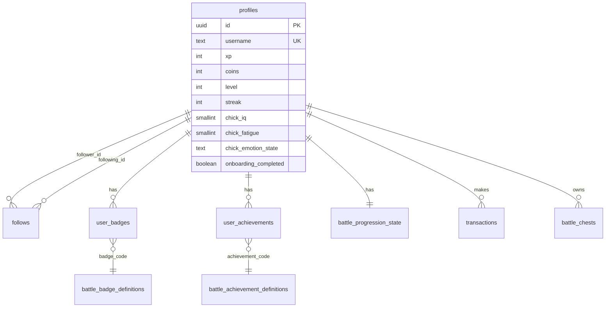
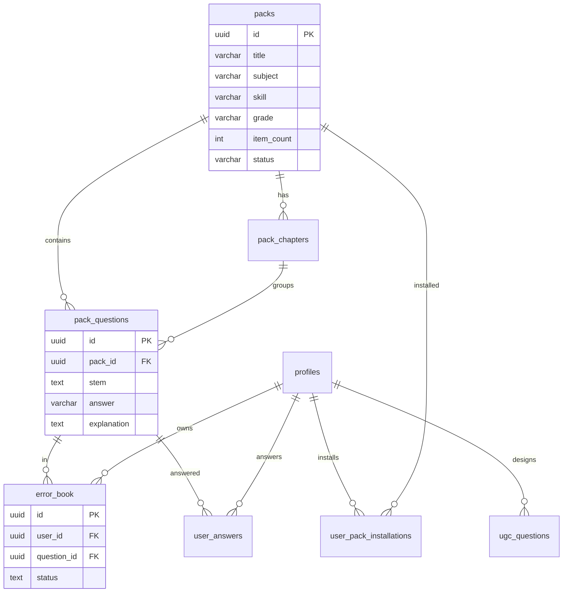
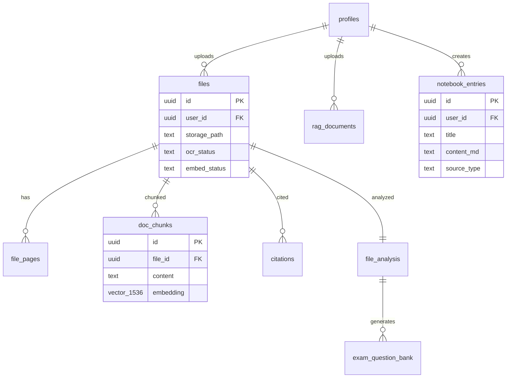
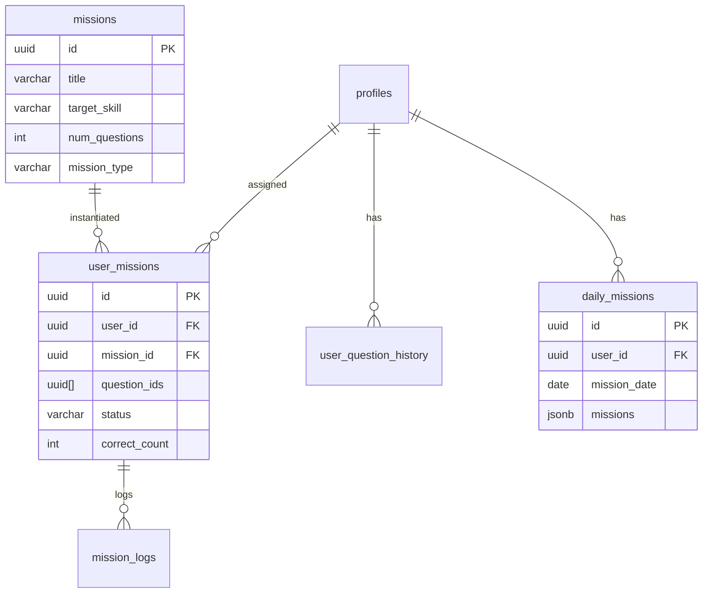

# 📊 PLMS Database ERD (Entity Relationship Diagram)

> 使用 Mermaid 語法繪製，GitHub/GitLab 可直接渲染

---

## 完整 ERD 總覽

```mermaid
erDiagram
    %% ==========================================
    %% USER & PROFILE DOMAIN
    %% ==========================================
    
    profiles ||--o{ follows : "follower"
    profiles ||--o{ follows : "following"
    profiles ||--o{ user_badges : "has"
    profiles ||--o{ user_achievements : "has"
    profiles ||--|| battle_progression_state : "has"
    profiles ||--o{ transactions : "has"
    profiles ||--o{ battle_chests : "has"
    
    profiles {
        uuid id PK
        text username UK
        text avatar_url
        int xp
        int coins
        int level
        int streak
        smallint chick_iq
        boolean onboarding_completed
    }
    
    follows {
        uuid id PK
        uuid follower_id FK
        uuid following_id FK
    }
    
    user_badges {
        uuid id PK
        uuid user_id FK
        text badge_code FK
    }
    
    battle_badge_definitions {
        text code PK
        text name
        text rarity
    }
    
    %% ==========================================
    %% QUESTIONS & PACKS DOMAIN
    %% ==========================================
    
    packs ||--o{ pack_chapters : "contains"
    packs ||--o{ pack_questions : "contains"
    pack_chapters ||--o{ pack_questions : "groups"
    packs ||--o{ user_pack_installations : "installed_by"
    profiles ||--o{ user_pack_installations : "installs"
    
    pack_questions ||--o{ error_book : "tracked_in"
    pack_questions ||--o{ user_answers : "answered_in"
    
    packs {
        uuid id PK
        varchar title
        varchar subject
        varchar skill
        varchar grade
        varchar status
        int item_count
    }
    
    pack_chapters {
        uuid id PK
        uuid pack_id FK
        varchar title
        int order
    }
    
    pack_questions {
        uuid id PK
        uuid pack_id FK
        uuid chapter_id FK
        text stem
        text[] choices
        varchar answer
        text explanation
        varchar difficulty
    }
    
    user_pack_installations {
        uuid id PK
        uuid user_id FK
        uuid pack_id FK
        timestamptz installed_at
        int completed_count
    }
    
    error_book {
        uuid id PK
        uuid user_id FK
        uuid question_id FK
        text status
        timestamptz last_attempted_at
    }
    
    user_answers {
        uuid id PK
        uuid user_id FK
        uuid question_id FK
        boolean is_correct
    }
    
    seed_questions {
        uuid id PK
        text source
        text subject
        text question_text
        text correct_answer
        int difficulty_level
    }
    
    ugc_questions {
        uuid id PK
        uuid designer_id FK
        text question_text
        text correct_answer
        text review_status
    }
    
    %% ==========================================
    %% BATTLE & PROGRESSION DOMAIN
    %% ==========================================
    
    profiles ||--o{ battle_events : "participates"
    profiles ||--o{ match_history : "player1"
    profiles ||--o{ match_history : "player2"
    
    battle_events {
        uuid id PK
        uuid user_id FK
        uuid opponent_id FK
        text match_id
        text match_type
        jsonb question_id_array
        jsonb is_correct_array
    }
    
    match_history {
        uuid id PK
        uuid player1_id FK
        uuid player2_id FK
        uuid winner_id FK
        int player1_score
        int player2_score
    }
    
    battle_progression_state {
        uuid user_id PK
        numeric xp_multiplier
        int daily_streak_count
        jsonb active_badges
    }
    
    battle_chests {
        uuid id PK
        uuid user_id FK
        text chest_type
        text status
        jsonb rewards
    }
    
    %% ==========================================
    %% RAG & FILES DOMAIN
    %% ==========================================
    
    files ||--o{ file_pages : "contains"
    files ||--o{ doc_chunks : "chunked_into"
    files ||--o{ citations : "cited_in"
    files ||--|| file_analysis : "analyzed"
    file_analysis ||--o{ exam_question_bank : "generates"
    
    files {
        uuid id PK
        uuid user_id FK
        text storage_path
        text mime
        text ocr_status
        text embed_status
    }
    
    file_pages {
        uuid id PK
        uuid file_id FK
        int page_no
        text text
    }
    
    doc_chunks {
        uuid id PK
        uuid file_id FK
        int page_no
        int chunk_idx
        text content
        vector embedding
    }
    
    file_analysis {
        uuid id PK
        uuid file_id FK
        text quick_summary
        text detected_subject
        jsonb exam_predictions
    }
    
    %% ==========================================
    %% BACKPACK & NOTEBOOK DOMAIN
    %% ==========================================
    
    profiles ||--o{ notebook_entries : "owns"
    profiles ||--o{ backpack_items : "owns"
    profiles ||--o{ ai_interactions : "has"
    
    notebook_entries {
        uuid id PK
        uuid user_id FK
        text title
        text content_md
        text source_type
        text subject
    }
    
    backpack_items {
        uuid id PK
        uuid user_id FK
        text subject
        text title
        text content
    }
    
    %% ==========================================
    %% MISSIONS DOMAIN
    %% ==========================================
    
    missions ||--o{ user_missions : "instantiated"
    profiles ||--o{ user_missions : "assigned"
    user_missions ||--o{ mission_logs : "logged"
    profiles ||--o{ daily_missions : "has"
    
    missions {
        uuid id PK
        varchar title
        varchar target_skill
        int num_questions
        varchar mission_type
    }
    
    user_missions {
        uuid id PK
        uuid user_id FK
        uuid mission_id FK
        date mission_date
        uuid[] question_ids
        varchar status
    }
    
    daily_missions {
        uuid id PK
        uuid user_id FK
        date mission_date
        jsonb missions
        boolean all_completed
    }
    
    %% ==========================================
    %% ONBOARDING DOMAIN
    %% ==========================================
    
    profiles ||--o{ onboarding_sessions : "has"
    profiles ||--|| onboarding_task_configs : "has"
    
    onboarding_sessions {
        uuid id PK
        uuid user_id FK
        int current_step
        int challenge_score
        text status
    }
    
    onboarding_task_configs {
        uuid id PK
        uuid user_id FK
        text[] weak_areas
        int daily_task_size
    }
    
    %% ==========================================
    %% COMMUNITY DOMAIN
    %% ==========================================
    
    profiles ||--o{ posts : "creates"
    posts ||--o{ post_likes : "liked"
    posts ||--o{ comments : "has"
    
    posts {
        uuid id PK
        uuid user_id FK
        text content
        int likes
    }
    
    %% ==========================================
    %% CHICK & ANALYTICS
    %% ==========================================
    
    profiles ||--o{ chick_messages : "receives"
    profiles ||--o{ analytics_events : "generates"
    
    chick_messages {
        uuid id PK
        uuid user_id FK
        text type
        text text
    }
    
    analytics_events {
        uuid id PK
        varchar event_id UK
        varchar event_name
        uuid user_id FK
        jsonb payload
    }
```

---

## 分 Domain ERD

### User & Profile Domain

### Questions & Packs Domain

### RAG & Files Domain

### Missions Domain

---

## 外鍵關係速查表

| 表 | 外鍵欄位 | 參照表 |
|----|----------|--------|
| `follows` | follower_id, following_id | profiles |
| `user_badges` | user_id | profiles |
| `user_badges` | badge_code | battle_badge_definitions |
| `user_pack_installations` | user_id | auth.users |
| `user_pack_installations` | pack_id | packs |
| `pack_chapters` | pack_id | packs |
| `pack_questions` | pack_id | packs |
| `pack_questions` | chapter_id | pack_chapters |
| `error_book` | user_id | auth.users |
| `error_book` | question_id | pack_questions |
| `user_answers` | user_id | auth.users |
| `user_answers` | question_id | pack_questions |
| `battle_events` | user_id, opponent_id | auth.users |
| `match_history` | player1_id, player2_id, winner_id | profiles |
| `files` | user_id | auth.users |
| `file_pages` | file_id | files |
| `doc_chunks` | file_id | files |
| `file_analysis` | file_id | files |
| `notebook_entries` | user_id | auth.users |
| `user_missions` | user_id | auth.users |
| `user_missions` | mission_id | missions |
| `daily_missions` | user_id | profiles |
| `onboarding_sessions` | user_id | profiles |

---

**生成日期**: 2025-01  
**相關文件**: `schema.sql`, `docs/db/schema_overview.md`

